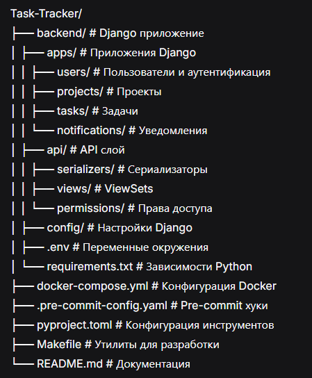

# Task Tracker - Система управления задачами сотрудников


Веб-приложение для управления задачами сотрудников в командах и проектах с поддержкой файловых вложений.

## 🌟 Демонстрация


## 🚀 Основные возможности

### 📋 Управление проектами
- Создание, редактирование, архивация проектов
- Назначение участников проекта
- Отслеживание статусов проектов
- Прикрепление файлов к проектам

### ✅ Трекинг задач
- Создание и назначение задач
- Статусы задач (к выполнению, в процессе, завершено)
- Приоритеты и сроки выполнения
- Привязка задач к проектам
- Вложения файлов к задачам

### 📁 Файлы и вложения
- Загрузка файлов до 10MB
- Автоматическое определение типа файла
- Прикрепление файлов к задачам, проектам, пользователям
- Публичные и приватные файлы
- Скачивание файлов с проверкой прав
- Статистика использования хранилища

### 👥 Работа в команде
- Кастомная модель пользователя с ролями
- Ролевая модель (сотрудник, менеджер, администратор)
- Назначение исполнителей задач
- Управление участниками проектов
- Персональные файловые хранилища

### 🔐 Безопасность и доступ
- JWT аутентификация с refresh токенами
- Разграничение прав по ролям
- Валидация MIME типов файлов
- Проверка прав доступа к файлам
- Публичные/приватные вложения

### 🖥️ Веб-интерфейс
- Современный адаптивный дизайн с Bootstrap 5
- Главная страница с статистикой
- Интерактивная навигация
- Анимации и плавные переходы
- Информация о системе

### 📡 REST API
- Полный CRUD для проектов, задач и файлов
- Фильтрация и поиск
- Swagger/OpenAPI документация
- CORS поддержка для фронтенда
- Мультипарт загрузка файлов

### 🤖 Телеграм рассылка

- ✅ Управление задачами с приоритетами и сроками
- 🤖 Telegram-бот для уведомлений (@MyTaskPilotBot)
- 📧 Email-уведомления о новых задачах и изменениях статуса
- 📊 Автоматические отчеты (еженедельные, просроченные задачи)
- 🔔 Авто-напоминания о дедлайнах
- 👥 Назначение задач на сотрудников
- 🏷️ Группировка задач по проектам

## 🤖 Telegram Интеграция

Бот **@MyTaskPilotBot** подключен для автоматических уведомлений:

### 📨 Что умеет бот:
- Уведомления о новых назначенных задачах
- Изменения статусов задач
- Напоминания о просроченных задачах
- Еженедельные отчеты для администраторов

### ⚙️ Настройка бота:
1. Получите токен у @BotFather
2. Добавьте в `.env.development`:
- TELEGRAM_BOT_TOKEN=ваш_токен
- TELEGRAM_CHAT_IDS={"admin": "ваш_chat_id"}
3. Напишите боту `/start` для активации

### 🛠️ Команды управления:
```bash
# Тестирование бота
python manage.py test_telegram --message "Привет!"

# Проверка просроченных задач
python manage.py check_overdue

# Еженедельный отчет
python manage.py weekly_report
```
## 🏗️ Технологический стек

### Backend
- **Python 3.12** - основной язык
- **Django 6.0** - веб-фреймворк
- **Django REST Framework** - REST API
- **PostgreSQL / SQLite** - базы данных
- **Pillow** - обработка изображений
- **python-magic** - определение MIME типов
- **Gunicorn** - WSGI сервер (для продакшена)

### Frontend (шаблоны)
- **HTML5, CSS3** - разметка и стили
- **Bootstrap 5.3** - CSS-фреймворк
- **JavaScript** - интерактивность
- **Bootstrap Icons** - иконки

### Инструменты разработки
- **Docker & Docker Compose** - контейнеризация
- **Black, Flake8** - форматирование и линтинг
- **MyPy** - статическая типизация
- **Pytest** - тестирование
- **Pre-commit** - автоматические проверки

### Документация
- **Swagger/OpenAPI** - интерактивная документация API
- **ReDoc** - альтернативная документация
- **Django Debug Toolbar** - отладка в разработке

## 📁 Структура проекта



## 🚀 Быстрый старт

### Предварительные требования
- Python 3.12+
- PostgreSQL 15+
- Docker & Docker Compose (опционально)
- Git

### Установка и запуск

1. **Клонирование репозитория**
```bash
git clone https://github.com/Anton742-Tu/task-tracker.git
cd task-tracker
```
2. **Настройка окружения**

```bash
# Перейдите в директорию backend
cd backend

# Создайте виртуальное окружение
python -m venv .venv

# Активация (Windows PowerShell)
.venv\Scripts\Activate.ps1

# Активация (Linux/Mac)
source .venv/bin/activate

# Установите зависимости
pip install -r requirements.txt
```
3. **Настройка переменных окружения**

```bash
# Скопируйте шаблон
cp .env.example .env

# Отредактируйте .env (обязательные параметры):
# DEBUG=True
# SECRET_KEY=your-secret-key-here
# DJANGO_ENVIRONMENT=development
# DB_NAME=task_tracker_dev
# DB_USER=postgres
# DB_PASSWORD=postgres
# DB_HOST=localhost
# DB_PORT=5432
```
4. **Настройка базы данных**

```bash
# Применение миграций
python manage.py migrate

# Создание суперпользователя
python manage.py createsuperuser
# Или создайте через скрипт:
python -c "
from apps.users.models import User
User.objects.create_superuser(
    username='admin',
    email='admin@example.com',
    password='admin123',
    role='admin'
)
"
```
5. **Запуск сервера разработки**
```bash
# Убедитесь что окружение установлено
$env:DJANGO_ENVIRONMENT = 'development'  # Windows PowerShell
# export DJANGO_ENVIRONMENT=development  # Linux/Mac

# Запустите сервер
python manage.py runserver
```
6. **Добавьте Telegram бота**
- Создайте бота через @BotFather
- Получите токен
- Добавьте TELEGRAM_BOT_TOKEN в .env.development
7. **Проверьте работу бота**
```bash
python manage.py test_telegram
```
## 🌐 Доступ к сервисам

🌐 Главная страница: http://localhost:8000/

👑 Админ-панель: http://localhost:8000/admin/

📚 API: http://localhost:8000/api/

📖 Swagger: http://localhost:8000/swagger/

📘 ReDoc: http://localhost:8000/redoc/

## ⚙️ Настройка окружения

Проект использует модульную структуру настроек Django с поддержкой разных окружений.

### Структура настроек


### Переменные окружения
Ключевые переменные в `.env` файле:

| Переменная | Описание | Пример |
|------------|----------|--------|
| `DJANGO_ENVIRONMENT` | Окружение Django | `development` |
| `DEBUG` | Режим отладки | `True` |
| `SECRET_KEY` | Секретный ключ Django | (сгенерируйте) |
| `ALLOWED_HOSTS` | Разрешенные хосты | `localhost,127.0.0.1` |
| `DB_NAME` | Имя БД | `task_tracker_dev` |
| `DB_USER` | Пользователь БД | `postgres` |
| `DB_PASSWORD` | Пароль БД | `postgres` |
| `DB_HOST` | Хост БД | `localhost` |
| `DB_PORT` | Порт БД | `5432` |

### Быстрые команды

```bash
# Разработка
$env:DJANGO_ENVIRONMENT='development'
python manage.py runserver

# Тестирование
$env:DJANGO_ENVIRONMENT='testing'
pytest

# Продакшен (подготовка)
$env:DJANGO_ENVIRONMENT='production'
python manage.py collectstatic --noinput
Решение проблем
Ошибка 400 Bad Request
```
```bash
# 1. Проверьте ALLOWED_HOSTS
echo "ALLOWED_HOSTS=localhost,127.0.0.1,0.0.0.0,*" >> .env

# 2. Установите SECRET_KEY
echo "SECRET_KEY=django-insecure-dev-key-$(date +%s)" >> .env

# 3. Убедитесь в правильном окружении
$env:DJANGO_ENVIRONMENT='development'
```
### Ошибки импорта/кодировки
```bash
# Для Windows PowerShell
$env:PYTHONUTF8='1'
$env:PYTHONIOENCODING='utf-8'

# Запуск тестов с правильной кодировкой
pytest --disable-warnings
```
### Docker окружение
```bash
# Используйте .env.docker.example как шаблон
cp .env.docker.example .env.docker

# Запуск с Docker
docker-compose up --build
```
### Шаблоны .env файлов
.env.example - основной шаблон

.env.development.example - разработка

.env.production.example - продакшен

.env.docker.example - Docker

## 📡 API Endpoints
### Аутентификация
#### Метод	Endpoint	Описание	Требуется аутентификация
- POST	/api/auth/login/	Вход в систему	Нет
- POST	/api/auth/register/	Регистрация	Нет
- POST	/api/auth/logout/	Выход	Да
- GET	/api/auth/profile/	Профиль пользователя	Да
- POST	/api/auth/token/refresh/	Обновление токена	Да
### Проекты
#### Метод	Endpoint	Описание	Фильтры
- GET	/api/projects/	Список проектов	?status=active, ?search=название
- POST	/api/projects/	Создание проекта	-
- GET	/api/projects/{id}/	Детали проекта	-
- PUT	/api/projects/{id}/	Обновление проекта	-
- DELETE	/api/projects/{id}/	Удаление проекта	-
### Задачи
#### Метод	Endpoint	Описание	Фильтры
- GET	/api/tasks/	Список задач	?status=in_progress, ?project_id=1
- POST	/api/tasks/	Создание задачи	-
- GET	/api/tasks/{id}/	Детали задачи	-
- PUT	/api/tasks/{id}/	Обновление задачи	-
- DELETE	/api/tasks/{id}/	Удаление задачи	-
### Файлы и вложения
#### Метод	Endpoint	Описание	Параметры
- POST	/api/files/upload/	Загрузка файла	file, task_id, project_id, description
- GET	/api/files/	Список файлов	?task_id=1, ?project_id=1, ?file_type=image
- GET	/api/files/{id}/	Детали файла	-
- PUT	/api/files/{id}/	Обновление метаданных	description, is_public
- DELETE	/api/files/{id}/	Удаление файла	-
- GET	/api/files/{id}/download/	Скачивание файла	-
- GET	/api/files/stats/	Статистика хранилища	-
### Пример загрузки файла через cURL:
```bash
curl -X POST http://localhost:8000/api/files/upload/ \
  -H "Authorization: Bearer YOUR_JWT_TOKEN" \
  -F "file=@/path/to/your/file.jpg" \
  -F "task_id=1" \
  -F "description=Скриншот задачи"
```
## 🗂️ Типы поддерживаемых файлов
### Система поддерживает следующие типы файлов:
1. **Изображения**
- JPEG/JPG (.jpg, .jpeg)
- PNG (.png)
- GIF (.gif)
- WebP (.webp)
2. **Документы**
- PDF (.pdf)
- Microsoft Word (.doc, .docx)
- Microsoft Excel (.xls, .xlsx)
- Текстовые файлы (.txt)
- HTML (.html)
- JSON (.json)
3. **Архивы**
- ZIP (.zip)
- RAR (.rar)
- 7Z (.7z)
- TAR (.tar)
### Ограничения:
- Максимальный размер файла: 10 MB
- Все файлы проверяются на MIME тип
- Автоматическое определение категории файла

## 🔒 Права доступа к файлам
### Ролевая модель:
- Администратор: Полный доступ ко всем файлам
- Менеджер: Доступ к файлам своих проектов + публичные файлы
- Сотрудник: Доступ к своим файлам + публичные файлы + файлы назначенных задач

### Уровни доступа:
- Публичные файлы: Видны всем аутентифицированным пользователям
- Приватные файлы: Видны только владельцу и участникам связанного проекта/задачи
- Персональные файлы: Привязаны только к пользователю

## ⚙️ Конфигурация
### Переменные окружения (.env файл)
```bash
# Django
DEBUG=True
SECRET_KEY=your-secret-key-here
ALLOWED_HOSTS=localhost,127.0.0.1

# База данных
USE_POSTGRES=False
POSTGRES_DB=tasktracker
POSTGRES_USER=postgres
POSTGRES_PASSWORD=
POSTGRES_HOST=localhost
POSTGRES_PORT=5432

# Файлы
MAX_UPLOAD_SIZE=10485760  # 10MB в байтах

# Интернационализация
LANGUAGE_CODE=ru-ru
TIME_ZONE=Europe/Moscow

# CORS (для фронтенда)
CORS_ALLOWED_ORIGINS=http://localhost:3000,http://127.0.0.1:3000
```
### Настройки файловой системы в settings.py
```python
# Максимальный размер загрузки (10MB)
MAX_UPLOAD_SIZE = 10 * 1024 * 1024

# Разрешенные MIME типы
ALLOWED_FILE_TYPES = [
    'image/jpeg', 'image/png', 'image/gif', 'image/webp',
    'application/pdf',
    'application/msword',
    'application/vnd.openxmlformats-officedocument.wordprocessingml.document',
    'application/vnd.ms-excel',
    'application/vnd.openxmlformats-officedocument.spreadsheetml.sheet',
    'text/plain',
    'application/zip',
    'application/x-rar-compressed',
]
```
## 🐳 Docker развертывание
```bash
# Сборка и запуск всех сервисов
docker-compose up --build

# Запуск в фоновом режиме
docker-compose up -d

# Остановка всех сервисов
docker-compose down

# Просмотр логов
docker-compose logs -f backend

# Проверка состояния
docker-compose ps
Docker Compose файл поддерживает:
PostgreSQL - основная база данных

pgAdmin - веб-интерфейс для управления БД

Backend - Django приложение

Volume для постоянного хранения данных
```
## 🧪 Тестирование

### Запуск тестов
```bash
# Все тесты
pytest

# С покрытием кода
pytest --cov=.

# Конкретный модуль
pytest apps/users/tests/
pytest api/tests/auth/

# С подробным выводом
pytest -v --tb=short
Тестирование в CI/CD
```
### Проект готов к интеграции с GitHub Actions. Для запуска тестов в CI:

```bash
# Установите переменные окружения для тестов
export DJANGO_ENVIRONMENT=testing
export SECRET_KEY=test-secret-key
export DB_NAME=test_db

# Запустите тесты
pytest --disable-warnings
```
### Проверка качества кода
```bash
# Форматирование кода
black .

# Проверка линтером
flake8 .

# Проверка типов (опционально)
mypy .
```
### Покрытие тестами

```text
htmlcov/index.html
```

## 📈 Дорожная карта развития
### Версия 1.0 (реализовано)
✅ Базовая структура проекта

✅ Модели пользователей, проектов, задач

✅ REST API с документацией

✅ JWT аутентификация

✅ Ролевая модель (employee, manager, admin)

✅ Веб-интерфейс с Bootstrap

✅ Система файлов и вложений

✅ Валидация и безопасность файлов

### Версия 1.1 📝 Что было добавлено (21.01.2026)
✅ Интеграция Telegram бота @MyTaskPilotBot

✅ Автоматические уведомления о задачах

✅ Раздельные настройки для dev/prod окружений

✅ Команды для управления ботом

✅ Безопасное хранение токенов в .env файлах

### Версия 1.2 (планируется)
Отчеты и аналитика

Календарь задач

Экспорт данных

Веб-интерфейс для управления файлами

Drag & drop загрузка файлов

### Версия 2.0 (будущее)
Отдельный фронтенд на React

Мобильное приложение

Интеграция с облачными хранилищами

WebSocket для реальных обновлений

Расширенная аналитика

## 👥 Участие в разработке
Форкните репозиторий

Создайте ветку для фичи (git checkout -b feature/amazing-feature)

Закоммитьте изменения (git commit -m 'Add amazing feature')

Запушьте ветку (git push origin feature/amazing-feature)

Создайте Pull Request

### Руководство по стилю кода
Используйте Black для форматирования

Проверяйте код через Flake8

Аннотируйте типы с помощью MyPy

Пишите тесты для нового функционала

Документируйте новые API endpoints

## 🐛 Отчет об ошибках
Нашли ошибку? Пожалуйста:

Проверьте существующие issues

Создайте новый issue с описанием проблемы

Укажите шаги для воспроизведения

Приложите логи или скриншоты если возможно

## 📄 Лицензия
Этот проект лицензирован под MIT License - смотрите файл [LICENSE](LICENSE) для деталей.
## 🤝 Контакты
Автор: Антон Тумашов
Email: Tumashovster@Gmail.com
GitHub: Anton742-Tu
Проект: https://github.com/Anton742-Tu/task-tracker

## 🙏 Благодарности
Команда Django за отличный фреймворк

Сообщество Django REST Framework

Bootstrap за прекрасные компоненты

Разработчикам python-magic и Pillow

Всем контрибьюторам open source проектов

⭐ Если вам нравится этот проект, поставьте звезду на GitHub! ⭐

### Поддержка проекта
Если проект оказался полезным, вы можете:

Сообщить об ошибках

Предложить новые функции

Создать Pull Request

Рассказать о проекте коллегам
